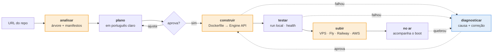

<p align="center">
  
</p>

<p align="center">
  <strong>Cole a URL do repositório. Diga onde quer que rode. O resto é com o Deplora.</strong><br>
  O agente que transforma um repositório em algo no ar — explicando cada passo, e lamentando junto quando quebra.
</p>

<p align="center">
  
</p>

<p align="center">
  <code>Java</code> · <code>Spring Boot</code> · <code>Quarkus</code> · <code>Node.js</code> · <code>Docker Engine API</code> · <code>SSH</code> · <code>LLM</code>
</p>

---

> **Status: em construção, em público.** O Deplora é o projeto-laboratório de duas pós-graduações
> (Java · Engenharia de IA). O `git log` é o histórico de aprendizado — um PR por conceito.
> Este README descreve o que está sendo construído e em que ordem. O que já roda está marcado ✅.

## O problema

Você gerou um app com IA. Ele roda no `localhost`. E agora?

Pra colocar no ar, alguém precisa saber o que é uma imagem, uma porta, um health check, uma
variável de ambiente, um Dockerfile, um provider. Quem faz *vibe coding* não sabe — e não deveria
precisar. É aí que a maioria dos projetos de fim de semana morre: não no código, na **subida**.

## O que o Deplora faz

Você cola a URL do repositório e escolhe onde quer que rode. O Deplora:

1. **Lê o repositório** e descobre linguagem, framework, comando de build e de start, porta, se
   precisa de banco, quais variáveis faltam — sem você dizer nada.
2. **Escreve o plano** em português claro e mostra antes de fazer qualquer coisa:
   > "Seu app é Node 22, sobe com `node server.js`, escuta na porta 3000 e não precisa de banco.
   > Falta a variável `OPENAI_API_KEY`. Quer subir pra onde?"
3. **Constrói e testa localmente** — gera o Dockerfile, constrói a imagem, sobe, bate na porta,
   confirma que responde.
4. **Sobe no provider que você conectou** — seu VPS, Fly.io, Railway, AWS. O Deplora não hospeda;
   ele orquestra o deploy pra onde você quiser.
5. **Acompanha o primeiro boot.** Se quebrar, não devolve um stack trace: diz o quê, onde, e como
   consertar — e propõe a correção com um botão.

```
12:06:21  ✗ error: release version 21 not supported
12:06:22  deplora › lamento — o projeto pede Java 21; a imagem base que eu escolhi é 17.
12:06:22  deplora › troco para eclipse-temurin:21 e tento de novo? y
12:07:44  ✓ no ar · https://api-pedidos.fly.dev · 200 em 1m 42s
```

O nome é deploy + *deplorar* — lamentar. O produto ri do deploy que quebrou, mas existe para
que quebre menos. **Sério na função, leve na voz.**

## O princípio: complexo por dentro, simples por fora

> *"Vou construir um software muito complexo para deixar mais simples."*

Essa assimetria é o produto. Por fora: uma URL, um plano, um botão, um link. Por dentro, o
Deplora é construído **no nível mais baixo que faz sentido** — de propósito, porque cada camada
de abstração que não se usa é uma camada que se aprende:

| Camada | O que o Deplora **não** usa | O que faz no lugar |
|---|---|---|
| Detectar a stack | Buildpacks, Nixpacks | lê a árvore de arquivos e os manifestos com o próprio código; LLM só na ambiguidade |
| Gerar o Dockerfile | templates, `docker init` | o agente escreve; o código valida (multi-stage, non-root, sem `latest`); **o build tem que passar** |
| Construir e rodar | `docker build` / `docker run` por subprocess | fala com a **Docker Engine API** pelo socket Unix: contexto em tar, stream de build lido linha a linha, `containers/create` → `start` → `logs` → `wait` |
| Subir num VPS | Ansible, Terraform | **SSH do zero** — conexão, chave, `exec`, instalar Docker, subir o container, proxy reverso |
| Subir num provider | SDK oficial | cliente HTTP escrito à mão contra a API de cada um, atrás de um único port `Provider` |
| Segredos | cofre externo | detecta o que falta, pede, **nunca persiste** — injeta direto no provider |

A régua: *se a pessoa precisou aprender um conceito de infra pra seguir, o Deplora falhou.*

## Como funciona



O verificador do agente é sempre **a realidade**: a imagem buildou? o container respondeu?
o provider devolveu 200? Nenhum LLM dá nota ao trabalho de outro LLM aqui. O agente propõe;
a pessoa aprova; o código executa; o mundo confirma.

## Por que três runtimes

Não é vitrine. Cada peça roda onde a escolha é tecnicamente a certa — e dá pra defender em uma frase.

| Peça | Runtime | O argumento |
|---|---|---|
| **Runner** — analisa o repo, escreve o Dockerfile, fala com o Docker Engine API e com SSH, testa | **Quarkus nativo** (Java) | roda na máquina da pessoa ou num nó descartável: precisa subir em milissegundos e pesar pouco. O núcleo de baixo nível do projeto vive aqui |
| **Control plane** — projetos, planos aprovados, conexões de provider, histórico | **Spring Boot** | domínio rico e de longa vida; DDD de verdade; onde Spring brilha |
| **CLI + gateway** — `npx deplora` como porta de entrada; logs de build e boot ao vivo no terminal e no navegador | **Node.js** | o terminal que a pessoa já tem aberto; I/O intensivo com WebSocket e backpressure: o caso canônico do event loop |
| **Cérebro** — entende o repo onde os manifestos não bastam, escreve o primeiro Dockerfile, explica, diagnostica | LLM | a IA resolve a ambiguidade; o código e a realidade validam |

## O que torna isso difícil

1. **Código arbitrário de quem não sabe o que escreveu.** Detectar stack num repositório gerado
   por IA é lidar com monorepos acidentais, scripts de start esquisitos, portas hardcoded.
2. **O Dockerfile gerado tem que buildar.** E quando não builda, o loop detectar → construir →
   falhar → entender → corrigir é o harness de verdade — com verificador externo e budget.
3. **Docker sem o CLI.** Contexto em tar, stream multiplexado de stdout/stderr, ciclo de vida
   de container, tudo por HTTP num socket Unix.
4. **SSH do zero** e depois um proxy reverso com TLS num VPS que a pessoa nunca abriu.
5. **Um port `Provider`, N implementações** — e a prova de que o port é bom é a segunda
   implementação não exigir mudança no resto.

## Roadmap

| Fase | Entrega | Runtime que entra | Estado |
|---|---|---|---|
| 0 | Visão, arquitetura, identidade, este README | — | ✅ |
| 1 | **Caminho feliz, feio**: app Node sem Dockerfile → analisar → Dockerfile gerado → build e run pela Docker Engine API → health na porta → plano na tela | Java puro (vira o runner) | ◻ |
| 2 | Java (Gradle/Maven) e Python detectados; detector extensível | — | ◻ |
| 3 | Control plane: projetos, planos, aprovação, histórico | Spring Boot | ◻ |
| 4 | `npx deplora` + logs ao vivo | Node.js | ◻ |
| 5 | Primeiro provider: **VPS via SSH** — o mais baixo nível de todos | — | ◻ |
| 6 | Segundo provider via API HTTP (Fly.io ou Railway); o port `Provider` provado | — | ◻ |
| 7 | O cérebro: LLM na ambiguidade, no Dockerfile inicial e no diagnóstico — **com evals antes** | LLM | ◻ |
| 8 | `uses: deplora/deploy@v1` — o Actions como caminho alternativo | Node.js (Action) | ◻ |
| 9 | AWS como terceiro provider · o Deplora subindo a si mesmo | — | ◻ |

A regra que governa a ordem: **a fase 1 é um caminho feliz e feio, de ponta a ponta, num
repositório real.** Impossível no horizonte, não no primeiro commit.

## Identidade

<p>
  
  A marca é <strong>a gota</strong>: lágrima (o lamento) e <em>drop</em> (soltar a release) na mesma forma,
  com um caret <code>^</code> recortado — o mesmo do prompt <code>deplora ›</code> no log. É o mark e é o agente:
  o corpo é sempre âmbar, a expressão muda com o estado do deploy. Guia completo em
  <a href="docs/brand/identidade.html"><code>docs/brand/identidade.html</code></a>.
</p>
<br clear="all">

Regras de voz do agente, as seis que importam: sério na função, leve na voz · **o quê, onde, como** —
sempre os três · primeira pessoa, voz ativa · lamenta, não se desculpa · zero humor em risco real ·
propõe → pede permissão → executa.

## Documentação

- [`docs/VISAO.md`](docs/VISAO.md) — para quem, o que faz e não faz, por que baixo nível, as fases
- [`docs/ARQUITETURA.md`](docs/ARQUITETURA.md) — decisões, trade-offs e o que foi descartado
- [`docs/brand/`](docs/brand/) — identidade: guia, mark (SVG), lockup, GIF

## Licença

MIT — porque a ideia é que qualquer pessoa coloque o próprio app no ar, e que o Deplora aprenda
com cada deploy que quebrou.
