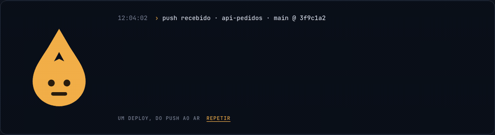
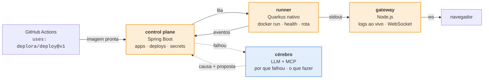
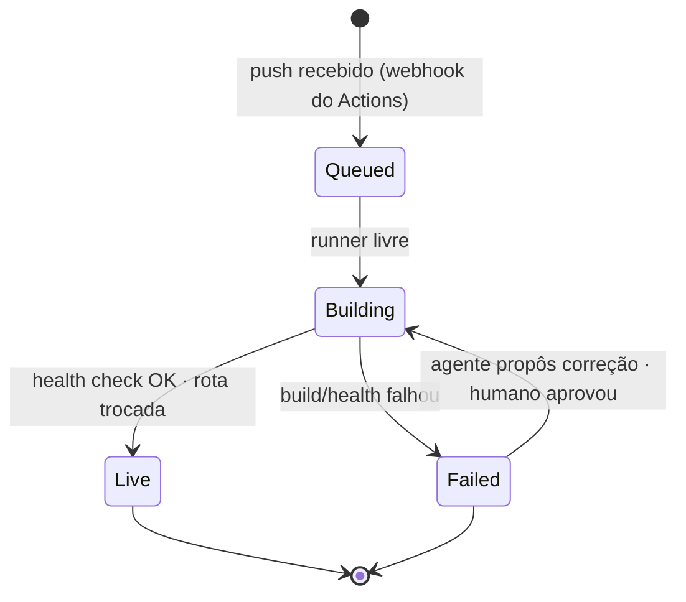

<p align="center">
  
</p>

<p align="center">
  <strong>O agente que constrói o deploy com você — e lamenta junto quando quebra.</strong><br>
  PaaS open source com GitHub Actions oficiais e diagnóstico de deploy por IA.
</p>

<p align="center">
  
</p>

<p align="center">
  <code>Spring Boot</code> · <code>Quarkus</code> · <code>Node.js</code> · <code>Docker</code> · <code>GitHub Actions</code> · <code>MCP</code>
</p>

---

> **Status: em construção, em público.** O Deplora é o projeto-laboratório de duas pós-graduações
> (Java · Engenharia de IA) — e o `git log` é o histórico de aprendizado, um PR por módulo.
> Este README descreve o que está sendo construído e em que ordem. O que já roda está marcado ✅.

## O que é

Você aponta um repositório. O Deplora monta o pipeline, acompanha o build e coloca o container no ar.
Quando algo falha, ele não devolve um stack trace: **diz o quê, onde e como consertar** — e propõe
a correção com um botão.

```
12:06:21  ✗ error: release version 21 not supported
12:06:22  deplora › lamento — o projeto pede Java 21; a imagem base é 17.
12:06:22  deplora › troco para eclipse-temurin:21 e tento de novo? y
12:07:44  ✓ no ar · https://api-pedidos.deplora.dev · 200 em 1m 42s
```

O nome é deploy + *deplorar* — lamentar. O produto ri do deploy que quebrou, mas existe para
quebrar menos. **Sério na função, leve na voz.**

## Por que três runtimes

Não é vitrine. Cada peça roda onde a escolha é tecnicamente a certa — e dá pra defender em uma frase.



| Peça | Runtime | O argumento |
|---|---|---|
| **Control plane** — apps, ambientes, deploys, secrets, histórico | **Spring Boot** | domínio rico e de longa vida; DDD de verdade (`App`, `Deploy`, `Environment` são aggregates com regras); segurança séria. Onde Spring brilha |
| **Runner** — recebe o artefato, sobe o container, health check, roteia, escala | **Quarkus nativo** | um por nó, tem que subir em milissegundos e usar pouca memória; fala com o Docker/K8s. É *o* caso de uso pra que o Quarkus existe |
| **Gateway** — logs e métricas ao vivo de N containers para M navegadores | **Node.js** | I/O intensivo, milhares de conexões persistentes, quase zero CPU: o caso canônico do event loop. O dashboard React vive aqui |
| **GitHub Action oficial** — `uses: deplora/deploy@v1` | **Node.js** | o runtime nativo do Actions. O Deplora **integra** com o Actions — não reimplementa o executor de workflows |
| **Cérebro** — analisa a falha (log + diff + histórico), diz por quê, propõe rollback; agente de operações via MCP | LLM + MCP | diagnóstico de deploy por IA é dor real e ninguém resolveu bem em open source |

**Fronteira de escopo, dita com clareza:** o Deplora não executa YAML de workflow. O Actions constrói;
o Deplora recebe o artefato e faz o resto. Reimplementar o Actions seria um segundo produto.

## A vida de um deploy



Quatro estados — e são os mesmos quatro que a gota expressa (veja *Identidade*). O status não é
uma coluna que alguém esquece de atualizar: é derivado de eventos do runner, e o control plane
reconcilia quando os dois discordam.

## O que torna isso difícil (o núcleo)

O CRUD de apps é aquecimento. O projeto vale pelo que está aqui:

1. **Orquestração confiável** — subir container, esperar health, trocar rota sem derrubar requisição
   em voo, matar o antigo. Onde 90% dos PaaS caseiros morrem.
2. **Zero-downtime de verdade** — blue-green, provado com carga rodando *durante* o deploy e zero
   requisições perdidas. Medido, não prometido.
3. **Stream de logs sob carga** — 50 containers falando, 20 navegadores ouvindo, sem estourar memória
   no gateway. Backpressure de verdade em Node.
4. **Estado distribuído** — control plane diz "Live", runner diz "morreu". Quem manda? Reconciliação,
   idempotência, o deploy que chegou duas vezes.
5. **IA com verificador externo** — o agente propõe; o deploy re-executado decide se ele acertou.
   Evals com dataset de falhas reais antes de mexer no prompt. O agente nunca aplica rollback sozinho.

## Roadmap

| Fase | Entrega | Runtime que entra | Estado |
|---|---|---|---|
| 0 | Identidade visual, arquitetura, este README | — | ✅ |
| 1 | **Monólito feio**: Spring recebe webhook do Actions com URL de imagem, roda `docker run` local, mostra "no ar" numa página tosca | Spring Boot | ◻ |
| 2 | Logs ao vivo no navegador | Node.js (gateway + React) | ◻ |
| 3 | Runner separado, fila entre control plane e runner | Quarkus nativo | ◻ |
| 4 | Action oficial publicada no Marketplace | Node.js (Action) | ◻ |
| 5 | Diagnóstico de falha por IA, com evals e verificador | LLM | ◻ |
| 6 | MCP server + agente de operações (propõe rollback, executa com aprovação) | MCP | ◻ |
| 7 | Blue-green provado sob carga · Testcontainers · ArchUnit · o próprio Deplora deployado na AWS | — | ◻ |

A regra que governa a ordem: **semana 1 é um monólito feio**. Impossível no horizonte, não no
primeiro commit.

## Identidade

<p>
  
  A marca é <strong>a gota</strong>: lágrima (o lamento) e <em>drop</em> (soltar a release) na mesma forma,
  com um caret <code>^</code> recortado — o mesmo do prompt <code>deplora ›</code> no log. É o mark e é o agente:
  o corpo é sempre âmbar, a expressão muda com o estado do deploy. Guia completo em
  <a href="docs/brand/identidade.html"><code>docs/brand/identidade.html</code></a>.
</p>
<br clear="all">

Regras de voz do agente, as seis que importam: sério na função, leve na voz · **o quê, onde, como** —
sempre os três · primeira pessoa, voz ativa · lamenta, não se desculpa · zero humor em risco real ·
propõe → pede permissão → executa.

## Documentação

- [`docs/ARQUITETURA.md`](docs/ARQUITETURA.md) — decisões, trade-offs e o que foi descartado
- [`docs/brand/`](docs/brand/) — identidade: guia, mark (SVG), lockup, GIF

## Licença

MIT — porque a ideia é que você faça deploy com ele, e que ele aprenda com cada deploy que quebrou.
