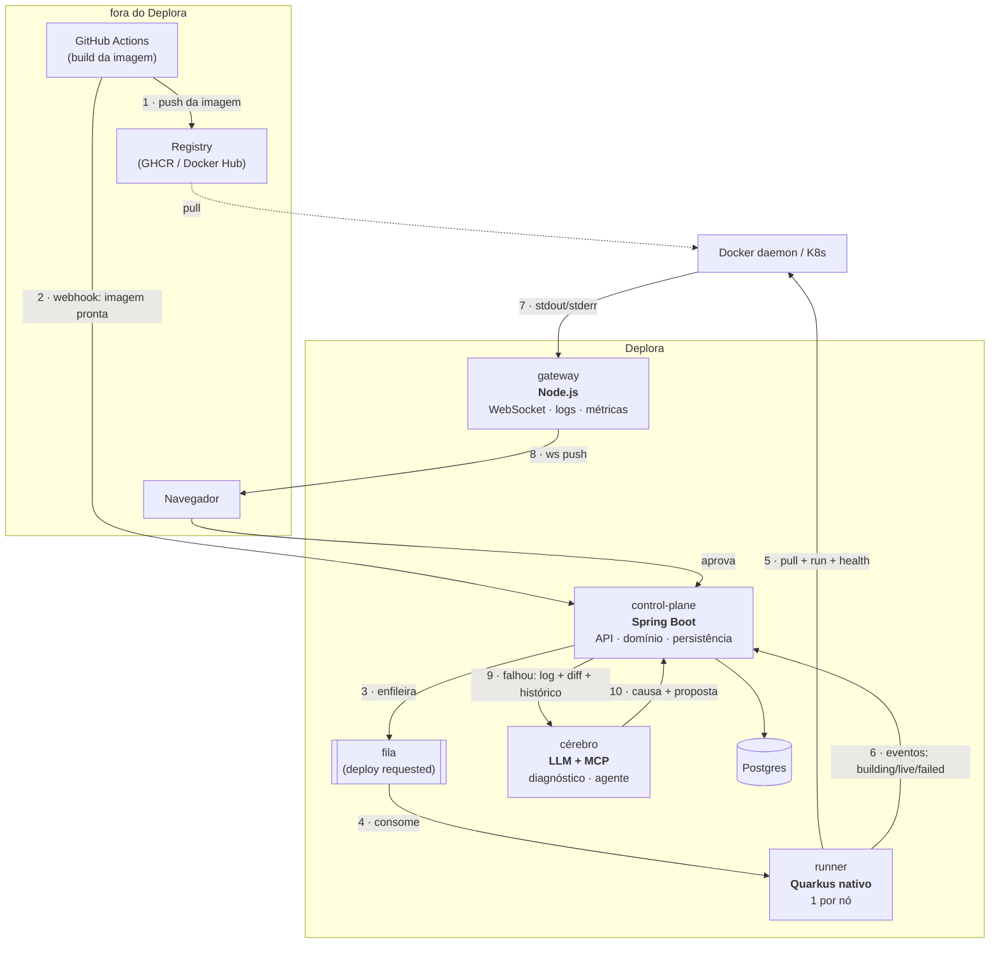

# Arquitetura do Deplora

> Documento vivo. Descreve as decisões tomadas, os trade-offs aceitos e o que foi descartado —
> e por quê. Cada fase do roadmap acrescenta uma seção; nenhuma apaga a anterior.

## 1. O problema

Um PaaS tem cinco responsabilidades: receber código, transformá-lo em algo executável, rodá-lo
com roteamento e escala, injetar configuração e segredos, e mostrar o que está acontecendo.
A maioria dos PaaS caseiros morre na terceira (rodar de forma confiável) ou na quinta
(observabilidade útil). O Deplora ataca as duas — e adiciona uma sexta responsabilidade que
nenhum PaaS open source resolve bem: **explicar a falha**.

## 2. Decisão estruturante: integrar com o GitHub Actions, não reimplementá-lo

A parte mais cara de um PaaS é o *build* — detectar linguagem, montar imagem, cachear
dependências. O GitHub Actions já faz isso bem, de graça, na máquina do GitHub. Então o Deplora
**publica uma Action oficial** (`uses: deplora/deploy@v1`) e recebe o artefato pronto.

O que isso compra: o Deplora começa no ponto em que a imagem existe. O que isso custa: dependência
do GitHub como ponto de partida (aceitável — é onde o código está) e a obrigação de manter a Action
compatível com versões de workflow (resolvido com versionamento semântico da Action).

**Fronteira de escopo:** o Deplora não interpreta YAML de workflow. Se isso mudar, é outro produto.

## 3. Os três runtimes — cada um onde é a escolha certa

A restrição é de aprendizado (duas pós), mas a regra é de engenharia: nenhum runtime entra por
decreto. Cada um tem que estar onde um engenheiro sênior o colocaria sem saber da restrição.

### 3.1 Control plane — Spring Boot

O único serviço com domínio rico: `App`, `Environment`, `Deploy`, `Release`, `Secret`. É onde vivem
as regras — um deploy não pula de `Queued` para `Live`; um `Secret` nunca é lido de volta; um
rollback é a promoção de uma `Release` anterior, não um deploy novo.

- **DDD**: bounded contexts Identidade · Aplicações · Deploy · Observabilidade. `Deploy` não conhece `User`.
- **Arquitetura limpa**: `domain` sem Spring; `application` com casos de uso e ports; `infrastructure`
  com JPA/Postgres e o cliente da fila; `presentation` com os controllers. ArchUnit garante a direção
  das dependências no CI.
- **Padrões que entram por necessidade, não por catálogo**: State (ciclo de vida do deploy),
  Strategy (rollout: recreate / blue-green / canary), Observer (eventos de domínio → fila),
  Builder (spec do container).

### 3.2 Runner — Quarkus nativo (GraalVM)

Um processo por nó de execução. Ele só sabe fazer uma coisa: pegar um `DeployRequested` da fila,
dar `pull`, subir o container, esperar o health check, trocar a rota, e reportar eventos. Precisa
subir em milissegundos (é escalado e morto com frequência) e usar pouca memória (roda ao lado
dos containers que serve). **Esse é exatamente o perfil para o qual o Quarkus nativo existe** — e a
comparação startup/memória contra uma versão Spring do mesmo runner é um artigo que vai sair daqui.

### 3.3 Gateway — Node.js

Logs e métricas de N containers para M navegadores, ao vivo. I/O intensivo, milhares de conexões
persistentes, quase nenhum CPU por conexão: o caso canônico do event loop. O problema de
engenharia real aqui é **backpressure** — um navegador lento não pode represar o log de um
container rápido. O dashboard React vive no mesmo mundo.

### 3.4 A Action — Node.js

GitHub Actions roda JavaScript nativamente. A Action é pequena por desenho: valida inputs, chama
a API do control plane, espera o deploy terminar e reporta no check do PR.

### 3.5 Cérebro — LLM + MCP

Quando um deploy falha, o control plane monta um contexto (últimas N linhas do log, diff do commit,
os últimos K deploys do app) e pede ao agente **causa provável + correção proposta**. O agente
**propõe**; um humano aprova; o runner executa; o resultado do re-deploy é o **verificador externo**
— o agente não dá nota ao próprio diagnóstico. Evals com um dataset de falhas reais rotuladas
existem antes do prompt ser otimizado. O MCP server expõe `list_deploys`, `get_logs`, `diagnose`
para agentes externos.

## 4. Comunicação: síncrono onde precisa de resposta, fila onde precisa de durabilidade

| Caminho | Tipo | Por quê |
|---|---|---|
| Actions → control plane (webhook) | HTTP síncrono | o Actions precisa de 2xx para marcar o step |
| control plane → runner | **fila** | deploy não pode se perder se o runner estiver reiniciando; permite N runners |
| runner → control plane (eventos) | **fila** | idempotência por `deployId + seq`; reconciliação se chegar fora de ordem |
| containers → gateway → navegador | stream | WebSocket com backpressure; o gateway descarta para o cliente lento, nunca para o produtor |
| control plane → cérebro | HTTP síncrono com timeout + budget de tokens | diagnóstico é best-effort; o deploy já falhou, nada depende da resposta chegar |

## 5. O que foi considerado e descartado

| Ideia | Por que não |
|---|---|
| Reimplementar o executor de workflows do Actions | segundo produto; o build é a parte mais cara e o GitHub já faz |
| Tudo em um runtime só (Spring) | funcionaria — mas o runner ficaria pesado onde precisa ser leve, e o gateway de logs em Servlet/threads é o jeito errado de fazer I/O intensivo |
| Kubernetes desde o dia 1 | complexidade que não ensina nada na fase 1; o runner fala com Docker primeiro e K8s depois, atrás do mesmo port |
| Status do deploy como coluna persistida | dado derivado desatualiza; status vem dos eventos do runner, e o control plane reconcilia |
| O agente aplicar rollback sozinho | nunca. Propõe, pede permissão, executa. Humor zero nesse caminho |
| Multi-agente para o diagnóstico | começa como workflow fixo (contexto → causa → proposta); só vira grafo se um sinal de escalada aparecer — e esse sinal é medido por eval, não por intuição |

## 6. Observabilidade do próprio Deplora

O Deplora é observado pelas mesmas ferramentas que ele oferece: o gateway faz stream dos logs do
control plane e do runner; métricas via Micrometer/Prometheus; traces OpenTelemetry ligando o
webhook ao evento `Live`. O dashboard 0 do projeto é o Deplora olhando para si mesmo.

## 7. Roadmap detalhado

Ver o README. A ordem existe por um motivo: **cada fase introduz um runtime ou um conceito**, e
nunca dois ao mesmo tempo — assim, quando algo quebra, só há um suspeito.

## 8. Decisões registradas (ADRs)

| # | Decisão | Data |
|---|---|---|
| 001 | Integrar com GitHub Actions via Action oficial; não reimplementar o executor | 2026-08-17 |
| 002 | Três runtimes com papel arquitetural: Spring (control plane), Quarkus nativo (runner), Node (gateway + Action) | 2026-08-17 |
| 003 | Fila entre control plane e runner; eventos idempotentes por `deployId + seq` | 2026-08-17 |
| 004 | Agente de IA propõe, nunca executa sem aprovação; re-deploy é o verificador externo | 2026-08-17 |
| 005 | Identidade: a gota com caret recortado; âmbar sobre tinta; mono como voz | 2026-08-19 |

_Novos ADRs entram aqui, um por decisão, com data. Decisões revertidas não são apagadas — ganham
uma linha "substituída por #n"._
