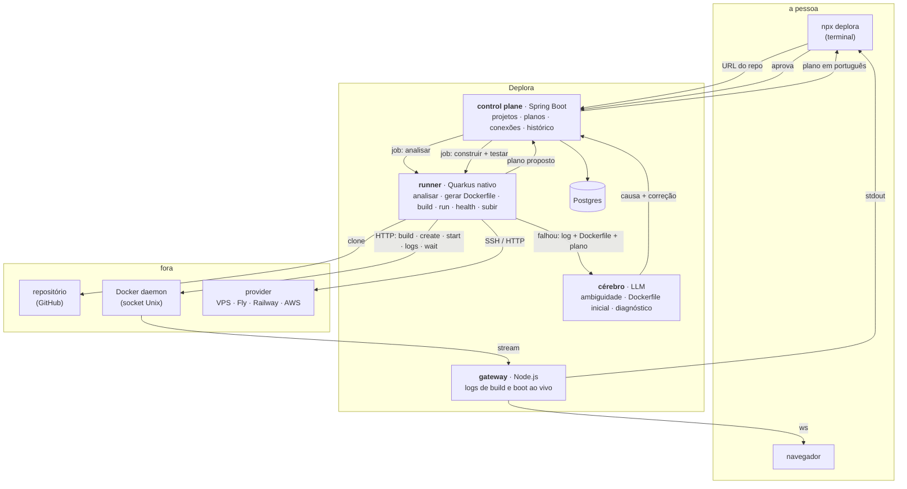

# Arquitetura do Deplora

> Documento vivo. Descreve as decisões tomadas, os trade-offs aceitos e o que foi descartado —
> e por quê. Cada fase do roadmap acrescenta uma seção; nenhuma apaga a anterior.
> A visão de produto (para quem, o que faz) está em [VISAO.md](VISAO.md); aqui é o *como*.

## 1. O problema de engenharia

Transformar **código arbitrário** — muitas vezes gerado por IA, sem Dockerfile, sem documentação,
com a porta hardcoded — em um container que builda, sobe, responde, e vai parar no provider que
a pessoa escolheu. E fazer isso explicando cada passo em linguagem de quem nunca ouviu falar em
Docker.

A dificuldade não está em nenhuma peça isolada. Está em **ligar as peças com verificação em cada
junta**: a detecção pode errar, o Dockerfile gerado pode não buildar, o container pode subir e
não responder, o provider pode aceitar e depois derrubar. O Deplora é, antes de tudo, o loop
**analisar → construir → testar → subir → acompanhar**, com diagnóstico e correção proposta em
cada ponto de falha.

## 2. Decisão estruturante: baixo nível por dentro, zero conceito de infra por fora

O Deplora é construído **sem as abstrações que escondem o que vale a pena aprender** — nem
Buildpacks, nem `docker` CLI por subprocess, nem SDK de provider, nem Ansible. Em troca, a
interface não exige nenhum conceito de infra da pessoa.

O custo: cada peça é mais trabalhosa de construir e de manter do que seria com a abstração
pronta. O ganho: controle total sobre o comportamento (essencial pra explicar cada passo e pra
diagnosticar falhas com precisão), e o aprendizado — que é o objetivo declarado do projeto.

Isso não é dogma. A régua é *"esta abstração esconde algo que eu quero aprender?"*. HTTP client,
JSON, SSH **cliente** (a biblioteca, não o protocolo à mão), o driver de banco — essas não
escondem nada que interesse aqui, e entram.

## 3. As peças



### 3.1 Runner — Quarkus nativo · o núcleo de baixo nível

É onde o projeto acontece. O runner:

- **analisa** o repositório: percorre a árvore, lê manifestos (`package.json`, `pom.xml`,
  `build.gradle(.kts)`, `requirements.txt`/`pyproject.toml`, `go.mod`), procura a porta no código,
  detecta `.env.example` e referências a variáveis, identifica dependências de serviço;
- **gera** o Dockerfile (multi-stage, imagem base na versão detectada, non-root, sem `latest`) e
  o valida antes de usar;
- **constrói** pela Docker Engine API: empacota o contexto em tar, `POST /build`, lê o stream
  JSON linha a linha;
- **testa**: `POST /containers/create` → `/start` → `/logs` (stream multiplexado) → health na
  porta detectada → `/stop` → `/rm`;
- **sobe** no provider via o port `Provider` (SSH para VPS; HTTP cru para os demais).

Roda na máquina da pessoa (via `npx deplora`) ou num nó descartável do control plane. Por isso
nativo: sobe em milissegundos, pesa pouco, morre sem dó.

### 3.2 Control plane — Spring Boot

Domínio: `Projeto`, `Plano` (a análise aprovada), `ConexaoDeProvider`, `Deploy`, `Historico`.
Regras: um `Plano` só vira `Deploy` depois de aprovado; uma `ConexaoDeProvider` guarda **como**
falar com o provider, nunca o segredo em claro; um `Deploy` tem ciclo de vida com transições
válidas e eventos, não coluna de status.

Arquitetura limpa: `domain` sem framework · `application` com casos de uso e ports ·
`infrastructure` (JPA, fila, clientes) · `presentation` (REST). ArchUnit vigia a direção das
dependências no CI.

### 3.3 CLI e gateway — Node.js

`npx deplora` é a porta de entrada: quem faz vibe coding já tem o terminal aberto. O CLI conversa
com o control plane, mostra o plano, pede aprovação, e **faz stream do build e do boot** em tempo
real — é a mesma peça que, como gateway WebSocket, alimenta o navegador. Backpressure é o
problema de engenharia real aqui: um cliente lento não pode represar o log de um build rápido.

### 3.4 Cérebro — LLM

Entra em três lugares, e em nenhum outro:

1. **Ambiguidade na análise** — "é um monorepo? qual é o serviço web? esse script de start é o
   certo?" — quando os manifestos não bastam. Com o contexto mínimo necessário, não o repo inteiro.
2. **Primeiro Dockerfile** — quando a stack detectada não tem gerador determinístico. O código
   valida sintaxe e políticas; **o build decide** se ele estava certo.
3. **Diagnóstico** — log + Dockerfile + plano → causa provável + correção proposta. A pessoa
   aprova; o runner aplica; o build/boot/provider confirma.

Invariantes: o LLM **nunca** executa (só propõe); **nunca** dá nota ao próprio trabalho (o
verificador é a realidade); **nunca** recebe segredos; tem budget de tokens e timeout por
chamada; e existem **evals** — um dataset de repositórios reais e de falhas reais rotuladas —
antes de qualquer prompt ser otimizado.

## 4. O port `Provider`

```
Provider
  conectar(credenciais) → Conexao          # valida, nunca persiste o segredo em claro
  subir(Conexao, Imagem, Plano) → Endereco  # idempotente por (projeto, versão)
  status(Conexao, Endereco) → Saude
  logs(Conexao, Endereco) → Stream
  derrubar(Conexao, Endereco)               # só com aprovação explícita
```

Primeira implementação: **VPS via SSH** — o mais baixo nível (conexão, chave, `exec`, instalar
Docker se faltar, `docker load`/`run` remoto, proxy reverso com TLS). Segunda: Fly.io ou Railway
por HTTP cru. A prova de que o port é bom: **a segunda implementação não exige mudar nada fora
dela.** Terceira: AWS.

## 5. Comunicação

| Caminho | Tipo | Por quê |
|---|---|---|
| CLI ↔ control plane | HTTP | pedidos curtos, resposta imediata |
| control plane → runner | **fila** | um job de análise/build não pode se perder; N runners |
| runner → control plane (eventos) | **fila**, idempotente por `deployId + seq` | reconciliação se chegar fora de ordem |
| runner → Docker | HTTP sobre socket Unix | é a Engine API; sem CLI no meio |
| build/boot → gateway → CLI/navegador | stream | WebSocket com backpressure |
| runner → provider | SSH ou HTTP | depende do provider; atrás do port |
| control plane → cérebro | HTTP com timeout + budget | best-effort; nada bloqueia esperando o LLM |

## 6. O que foi considerado e descartado

| Ideia | Por que não |
|---|---|
| Ser um PaaS (hospedar o app) — a visão original | hospedar é commodity e infra pesada; o valor está em **transformar repositório em deploy, em qualquer lugar**. Decisão #006 |
| Receber imagem pronta do Actions como única entrada | exclui exatamente o público-alvo (quem não tem Dockerfile nem workflow). O Actions vira um caminho alternativo, fase 8 |
| Buildpacks / Nixpacks para detectar e buildar | resolvem o problema e escondem tudo que vale aprender; e quando erram, erram opaco |
| `docker` CLI por subprocess | funciona — e esconde contexto, tar, stream e ciclo de vida, que são o aprendizado |
| SDK oficial dos providers | um port `Provider` com clientes HTTP próprios é mais trabalho e é o ponto |
| Kubernetes desde o dia 1 | complexidade que não ensina nada na fase 1; o provider é quem orquestra em produção |
| Status do deploy como coluna persistida | dado derivado desatualiza; vem dos eventos do runner |
| O agente aplicar correção ou rollback sozinho | nunca. Propõe → pede permissão → executa |
| Multi-agente para o diagnóstico | começa como workflow fixo; só vira grafo se um sinal de escalada aparecer — medido por eval |
| Persistir segredos da pessoa | nunca em claro; detecta o que falta, pede, injeta no provider |

## 7. Observabilidade do próprio Deplora

O runner e o control plane emitem métricas (Micrometer/Prometheus) e traces (OpenTelemetry)
ligando "URL colada" a "no ar". O dashboard 0 é o Deplora olhando para si mesmo.

## 8. Decisões registradas (ADRs)

| # | Decisão | Data | Estado |
|---|---|---|---|
| 001 | Integrar com GitHub Actions via Action oficial; não reimplementar o executor | 2026-08-17 | **substituída por #006** — o Actions vira caminho alternativo (fase 8), não a entrada principal |
| 002 | Três runtimes com papel arquitetural: Spring (control plane), Quarkus nativo (runner), Node (gateway) | 2026-08-17 | vigente; o Node ganha o CLI `npx deplora` |
| 003 | Fila entre control plane e runner; eventos idempotentes por `deployId + seq` | 2026-08-17 | vigente |
| 004 | Agente de IA propõe, nunca executa sem aprovação; a realidade é o verificador externo | 2026-08-17 | vigente, ampliada: o LLM também escreve o Dockerfile inicial e resolve ambiguidade de análise — sob as mesmas regras |
| 005 | Identidade: a gota com caret recortado; âmbar sobre tinta; mono como voz | 2026-08-19 | vigente |
| **006** | **O Deplora é um agente de deploy, não um PaaS**: entrada é a URL do repositório; ele analisa, gera o pipeline, constrói, testa e sobe no provider que a pessoa conectar. Construído em baixo nível (Docker Engine API, SSH, HTTP cru) por decisão de aprendizado; interface sem nenhum conceito de infra por decisão de produto | 2026-08-19 | vigente |
| **007** | Público-alvo: quem faz vibe coding. Régua de interface: *se a pessoa precisou aprender um conceito de infra pra seguir, o Deplora falhou* | 2026-08-19 | vigente |

_Novos ADRs entram aqui, um por decisão, com data. Decisões revertidas não são apagadas —
ganham "substituída por #n"._
