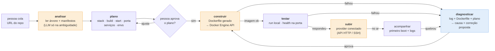

# Deplora — visão (revisada em 2026-08-19)

> Este documento substitui a premissa original de "PaaS que recebe imagem pronta do Actions".
> A mudança não é cosmética: o Deplora deixa de ser um PaaS e vira um **agente de deploy**.

## Para quem

Quem faz *vibe coding*: gerou um app com IA, ele roda no `localhost`, e a pessoa não faz ideia
de como isso vira produção. Não sabe o que é imagem, porta, health check, variável de ambiente.
Nem deveria precisar saber — mas hoje precisa, e é aí que a maioria dos projetos de fim de semana
morre.

## A promessa em uma frase

**Cole a URL do repositório, diga onde quer que rode, e o Deplora faz o resto — explicando cada
passo e lamentando junto quando quebra.**

## O princípio que governa tudo: complexidade por dentro, simplicidade por fora

> *"Eu vou construir um software MUITO complexo para deixar mais simples."*

Essa assimetria é o produto. "Baixo nível" descreve **como o Deplora é construído**, nunca **como
ele é usado**. A pessoa vê: uma URL, um plano em português claro, um botão, um link. Por dentro, o
Deplora lê árvores de arquivos, escreve Dockerfiles, fala HTTP com o daemon do Docker por um
socket Unix, abre SSH do zero, conversa com APIs cruas de provider. **Cada camada de abstração
que eu não uso é uma camada que eu aprendo — e que a pessoa nunca precisa ver.**

A régua pra qualquer decisão de interface: *se a pessoa precisou aprender um conceito de infra pra
seguir, o Deplora falhou.* Ela pode **querer** aprender — e aí o Deplora explica, porque cada passo
é dito em voz alta. Mas nunca **precisar**.

## O que o Deplora faz (e o que não faz)

| Faz | Não faz |
|---|---|
| **Lê o repositório** e descobre: linguagem, framework, gerenciador de pacotes, comando de build, comando de start, porta, dependências de serviço (Postgres? Redis?), variáveis necessárias | hospeda o app — o Deplora não é PaaS |
| **Escreve o pipeline**: Dockerfile, compose se precisar, e o plano de deploy — e mostra pra pessoa antes de executar | substitui o provider — ele orquestra o deploy **para** o provider que a pessoa conectar |
| **Constrói** a imagem localmente (ou no runner), testa se sobe e responde | guarda segredos da pessoa em texto claro |
| **Sobe** no provider conectado (Fly.io, Railway, Render, VPS via SSH, AWS) falando a API de cada um | faz mágica silenciosa — cada decisão é explicada, cada falha é diagnosticada |
| **Acompanha** o primeiro boot e, se quebrar, diz o quê, onde e como, e propõe a correção | executa rollback ou troca de provider sem aprovação |

## Por que bem baixo nível

A regra do projeto: **nenhuma camada de abstração que esconda o que eu quero aprender.**

| Camada | O que NÃO usar | O que fazer no lugar | O que se aprende |
|---|---|---|---|
| Detecção de stack | Buildpacks, Nixpacks, Railpack | ler a árvore de arquivos e os manifestos (`package.json`, `pom.xml`, `build.gradle`, `requirements.txt`, `go.mod`) com o próprio código + LLM pra ambiguidade | como os ecossistemas se declaram; o que é inferível e o que precisa perguntar |
| Geração do Dockerfile | templates prontos, `docker init` | o agente escreve o Dockerfile, multi-stage, com a imagem base certa pra versão detectada; o código valida sintaxe e políticas (non-root, sem `latest`) | camadas, cache, imagem base, por que multi-stage, tamanho × tempo |
| Build | `docker build` via CLI por subprocess | falar com o **Docker Engine API** pelo socket Unix (`/var/run/docker.sock`), mandar o contexto como tar, ler o stream de build | o que o CLI esconde: contexto, tar, stream de eventos, IDs de camada |
| Run + health | `docker run` | `POST /containers/create` + `/start` + `/logs` + `/wait` pela mesma API; health check é o teu código batendo na porta | ciclo de vida de container, stdout/stderr multiplexado, sinais |
| Provider | SDK oficial (AWS SDK, Fly SDK) | cliente HTTP escrito por ti contra a API REST/GraphQL de cada provider, com um **port** único (`Provider`) e um adaptador por provider | autenticação, idempotência, polling vs webhook, o que cada provider chama de "app" |
| VPS | Ansible, Terraform | SSH do zero (conexão, auth por chave, `exec`, `scp`), instalar Docker, subir o container, configurar o proxy reverso | o que um "servidor" é de verdade |
| Segredos | cofre externo | detectar `.env.example` e variáveis referenciadas no código; pedir os valores; **nunca** persistir — injetar só no provider | a fronteira entre config e segredo |

Isso é mais difícil do que usar as abstrações. Esse é o ponto.

## Onde a IA entra — e onde ela NÃO entra

| Papel da IA | Sim | Não |
|---|---|---|
| Entender o repositório quando os manifestos não bastam ("isso é um monorepo? qual é o serviço web?") | ✓ | — |
| Escrever o primeiro Dockerfile | ✓ | o código valida: sintaxe, políticas, e o build **tem que passar** — a IA não dá nota ao próprio Dockerfile |
| Diagnosticar o build/boot que falhou e propor correção | ✓ | aplicar sem a pessoa aprovar |
| Explicar cada decisão em linguagem de quem não sabe o que é Docker | ✓ | — |
| Decidir o provider, gastar dinheiro, apagar algo | — | ✗ nunca. Propõe, pede permissão, executa |

O verificador externo do agente é sempre **a realidade**: a imagem buildou? o container respondeu
na porta? o provider devolveu 200? Nenhum LLM julga o trabalho de outro LLM aqui.

## O fluxo de um deploy

## O que muda na arquitetura

| Antes (PaaS) | Agora (agente de deploy) |
|---|---|
| entrada: imagem pronta vinda do Actions | entrada: **URL de repositório** (o Actions vira um dos caminhos, não o único) |
| runner sobe container **no Deplora** | runner constrói e testa **localmente**; quem roda em produção é o **provider** da pessoa |
| o "cérebro" diagnostica falha | o cérebro **analisa o repo, escreve o pipeline, explica, e diagnostica** |
| control plane guarda apps/deploys/secrets | control plane guarda **projetos, planos aprovados, conexões de provider e histórico** — segredos nunca |
| valor: hospedar | valor: **transformar um repositório em algo no ar, em qualquer lugar, sem a pessoa precisar saber como** |

Os três runtimes continuam com papel claro — e um deles ganha ainda mais sentido:

- **Spring Boot** — control plane: projetos, planos, conexões, histórico, aprovações. Domínio rico.
- **Quarkus nativo** — o **runner local**: a peça que fala com o Docker Engine API e com SSH. Leve, sobe rápido, roda na máquina da pessoa ou num nó descartável.
- **Node.js** — gateway de logs ao vivo (o build stream e o boot do app são exatamente o que a pessoa precisa ver acontecendo) **e** o CLI: `npx deplora` é a porta de entrada natural pra quem faz vibe coding. Uma linha, no terminal que ela já tem aberto.

## O primeiro caminho (a semana 1 de verdade)

Um app Node/Express gerado por IA, no GitHub, sem Dockerfile. O Deplora:
1. clona, lê `package.json`, acha `"start": "node server.js"` e a porta no código;
2. escreve um Dockerfile multi-stage com `node:22-alpine`, non-root;
3. constrói pela **Docker Engine API** (socket Unix, contexto em tar, stream lido linha a linha);
4. sobe localmente, bate em `localhost:PORT`, confirma 200;
5. mostra na tela: "seu app é Node 22, sobe com `node server.js`, escuta na 3000, não precisa de banco. Quer subir pra onde?"

Sem provider ainda. Sem Spring ainda, até. **Só o runner + o analisador, em Java puro, falando com o Docker no baixo nível.** Quando isso rodar de ponta a ponta num repositório real, o resto tem onde encostar.

## Fases (revisadas)

| Fase | Entrega | O que se aprende |
|---|---|---|
| 1 | analisar repo Node + gerar Dockerfile + build/run pela Docker Engine API + health | Docker por dentro, HTTP sobre socket Unix, tar, streams |
| 2 | mesmo fluxo pra Java (Gradle/Maven) e Python — o detector vira extensível | como cada ecossistema se declara; Strategy pra detecção |
| 3 | control plane Spring: projetos, planos, aprovação, histórico | DDD, arquitetura limpa, persistência |
| 4 | CLI `npx deplora` + gateway de logs ao vivo | Node: streams, backpressure, WebSocket, UX de terminal |
| 5 | primeiro provider: **VPS via SSH** (o mais baixo nível de todos) | SSH do zero, Docker remoto, proxy reverso, TLS |
| 6 | segundo provider: Fly.io ou Railway via API HTTP crua | contratos de API, polling, idempotência — e o port `Provider` provado com 2 implementações |
| 7 | o cérebro: LLM na ambiguidade da análise, no Dockerfile inicial e no diagnóstico — **com evals antes** | harness engineering de verdade: verificador externo, budget, loop |
| 8 | `uses: deplora/deploy@v1` — o Actions como caminho alternativo de entrada | a Action em Node; o Deplora rodando dentro de um workflow |
| 9 | AWS (ECS) como terceiro provider · o Deplora deployando a si mesmo | o meta-momento |

## O que NÃO muda

A identidade (a gota, âmbar sobre tinta, mono como voz), a voz do agente (o quê, onde, como;
lamenta, não se desculpa; propõe → pede permissão → executa), a regra do monólito feio, e a
disciplina: **um PR por conceito, medir antes de otimizar, uma nota por módulo no Obsidian.**
